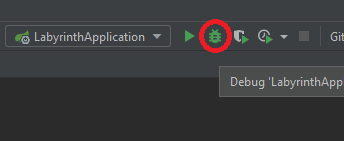

# Labyrinth

## Requirements:

- JDK 18 or higher
- PostgreSQL
  * by default, the application expects PostgreSQL exposed on localhost:5432 with username/password `postgres`/`postgres`
  * run PostgreSQL using Docker: `docker run -d --rm -p 5432:5432 -e POSTGRES_PASSWORD=postgres postgres`
- NodeJS

---

## How to run Backend:

* `./gradlew bootRun`

or via plain old good `java -jar`:

- Build: `./gradlew bootJar`
- Run: `java --enable-preview -jar build/libs/labyrinth.jar`

or via Docker:

- Build: `./gradlew bootBuildImage`
- Run: `docker run -d --rm -p 8080:8080 -e POSTGRES_URL=jdbc:postgresql://postgres:5432/labyrinth --link postgres:postgres labyrinth:2.0`

or using IntelliJ IDEA:

- \*click\*

---

## How to run Frontend:

1. `cd ui`
2. `npm install`
3. `npm run start`

---

## Production deployment example:

1. Build backend JAR and place it where you're going to run it, e.g.

    ./gradlew build
    cp build/libs/labyrinth.jar /path/to/labyrinth/

2. Create `.env` file under `ui` folder and set `API_HOST` variable there. This variable targets the root of application backend, e.g.

    cd ui
    echo API_HOST=https://labyrinth.example.com/api > .env

3. Build frontend in production mode and copy the result to the folder where you're going to serve static content, e.g.

    npm run build 
    cp -rf dist/. /path/to/labyrinth/labyrinth-ui/

4. Configure `labyrinth.service` systemd unit. Take care of environment variables to point database location and credentials.

    [Unit]
    Description=Labyrinth
    After=network-online.target
    Wants=network-online.target
    
    [Service]
    User=labyrinth
    Restart=always
    WorkingDirectory=/path/to/labyrinth
    ExecStart=/opt/java/jdk-18.0.1.1/bin/java --enable-preview -Dspring.profiles.active=prod -jar /path/to/labyrinth/labyrinth.jar
    Environment=POSTGRES_URL=jdbc:postgresql://localhost:5432/labyrinth
    Environment=POSTGRES_USERNAME=postgres
    Environment=POSTGRES_PASSWORD=postgres
    
    [Install]
    WantedBy=multi-user.target

5. Configure nginx:

    server {
        server_name labyrinth.example.com;
        listen 443 ssl;
        include "/etc/nginx/conf/labyrinth-ssl.conf";
    
        root /path/to/labyrinth/labyrinth-ui;
    
        location /api {
            rewrite           /api/(.*)  /$1  break;
            proxy_pass        http://localhost:8080;
            proxy_set_header  Host       $host;
            proxy_set_header  X-Real-IP  $remote_addr;
        }
    
        location /api/ws {
            rewrite           /api/ws     /ws  break;
            proxy_pass        http://localhost:8080;
            proxy_set_header  Host        $host;
            proxy_set_header  X-Real-IP   $remote_addr;
            proxy_set_header  Upgrade     $http_upgrade;
            proxy_set_header  Connection  "Upgrade";
        }
    }

6. You're done! Now run new systemd service and nginx.